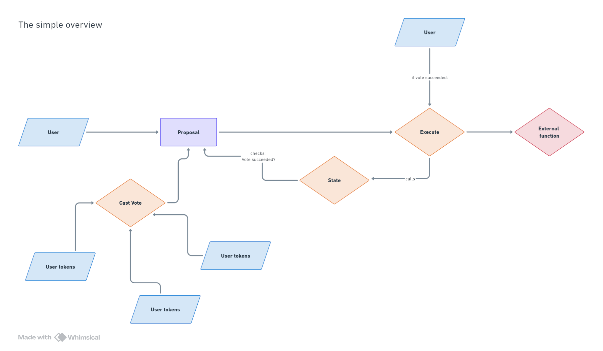
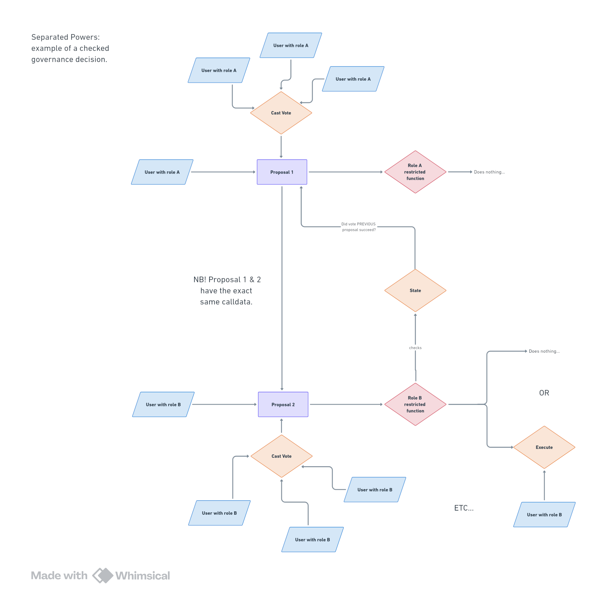

<!--
*** NB: This template was taken from: https://github.com/othneildrew/Best-README-Template/blob/master/README.md?plain=1 
*** For shields, see: https://shields.io/
*** if was further adapted for solidity along example from https://github.com/Cyfrin/6-thunder-loan-audit
-->
<a name="readme-top"></a>

<!-- PROJECT SHIELDS -->
<!--
*** I'm using markdown "reference style" links for readability.
*** Reference links are enclosed in brackets [ ] instead of parentheses ( ).
*** See the bottom of this document for the declaration of the reference variables
*** for contributors-url, forks-url, etc. This is an optional, concise syntax you may use.
*** https://www.markdownguide.org/basic-syntax/#reference-style-links
-->

[![Issues][issues-shield]][issues-url]
[![MIT License][license-shield]][license-url]
[![LinkedIn][linkedin-shield]][linkedin-url]

<!-- PROJECT LOGO -->
<br />
<div align="center">
  <a href="https://github.com/7Cedars/separated-powers"> 
    
  </a>

<h3 align="center">Separated Powers: Introducing separation of powers to DAO Governance </h3>

  <p align="center">
    A protocol providing restricted governance processes for DAOs. 
    <br />
    <a href="https://github.com/7Cedars/loyalty-program-contracts"><strong>Explore the docs »</strong></a>
    <br />
    <br />
    <!--NB: TO DO --> 
    <a href="https://sepolia.arbiscan.io/">View an example contract on arb .etherscan.io.</a>
    ·
    <a href="https://github.com/7Cedars/loyalty-program-contracts/issues">Report Bug</a>
    ·
    <a href="https://github.com/7Cedars/loyalty-program-contracts/issues">Request Feature</a>
  </p>
</div>

<!-- TABLE OF CONTENTS -->
<details>
  <summary>Table of Contents</summary>
  <ol>
    <li>
      <a href="#about">About</a>
      <ul>
        <li><a href="#important-files-and-folders">Important files and folders</a></li>
        <li><a href="#built-with">Built With</a></li>
      </ul>
    </li>
    <li>
      <a href="#getting-started">Getting Started</a>
      <ul>
        <li><a href="#prerequisites">Prerequisites</a></li>
        <li><a href="#installation">Installation</a></li>
      </ul>
    </li>
    <li><a href="#usage">Usage</a></li>
    <li><a href="#roadmap">Roadmap</a></li>
    <li><a href="#contributing">Contributing</a></li>
    <li><a href="#license">License</a></li>
    <li><a href="#contact">Contact</a></li>
    <li><a href="#acknowledgments">Acknowledgments</a></li>
  </ol>
</details>

<!-- ABOUT THE PROJECT -->
## About
The extension restricts access to governance processes along restricted roles. 

### What is the problem? 
Current DAO governance tends to be highly centralised. In the large majority of cases, voting power in DAO is linked, in one way or another, to the tokens user own. It leads to a small group of users having an outsized influence on DAO decision making processes and disengagement among most other DAO members.  

### What is the solution? 
- Acknowledging that a DAO consists of individuals with different _stakes_ in managing the shared _asset_. A DAO can have, for example, asset holders, users, builders, leaders with a stake in the value, accessibility, security and adoption of the asset respectively. The type of stakes differ between DAOs, but an asset rarely represents all the stakes of its members. 
- Create distinct roles for groups with specific stakes in a DAO, and give each restricted privileges so that their powers check and balance each other.
- Using formal roles to separate powers in governance is a tried and true approach to safeguarding decentralisation of (social, political and economic) assets in light of their tendency to centralise around informal elites.

### How does it work? 

#### Option 1: The traditional approach to DAO governance, using OpenZeppelin's Governor.sol contract
- A user proposes a proposal, that includes external target contract(s), values(s) and calldata(s). 
- Users vote on this proposal, often their votes are weighted by the tokens they own or that have been delegated to them. 
- When a user calls the execute function, it checks if the proposal has succeeded (and is not queued). If this is the case, the external functions are called with the values and calldatas.
- Alternatively, the execute function can be called directly to call external function directly. This functionality has to be role restricted. 
  
As a flowchart 
  <a href="https://github.com/7Cedars/separated-powers/blob/master/public/GovernanceSimple_flowchart.png"> 
    
  </a>

Using Governance.sol has a number of important implications
- There are inherent risks to using token weighted voting in DAO governance. To mitigate these risks, the governance logic needs to be adapted. 
- Any adaptation to Governance.sol - either in the core protocol or through added modules - adds complexity: delays, guardian roles, queueing, rage quitting, etc etc. It never stops.  

#### Option 2: Using SeparatedPowers.sol, have role B check decisions of role A
- A user with role A proposes a proposal directed at a role restricted external function A. The function allows for including calldata with target contract(s), values(s) and calldata(s).
- Users with role A vote on this proposal, their votes are not weighted.
- When the vote passes, nothing happens. 
- A user with role B proposes a proposal directed at a role restricted external function B. The function _only allows for including calldata with target contract(s), values(s) and calldata(s) that have been included in proposals to restricted external function A_. 
- When a user calls external function B it checks if _both_ proposal A and proposal B have passed. If this is the case, the external functions calls execute with the values and calldatas included in the proposal.
- The proposal chain can be made as long as required.  

As a flowchart
  <a href="https://github.com/7Cedars/separated-powers/blob/master/public/SeparatedPowers_flowchart.png"> 
    
  </a>

Using SeparatedPowers.sol has a number of important implications  
- The execute function in SeparatedPowers cannot be called directly, it can only be called through external restricted functions.
- External restricted functions need to be whitelisted within SeparatedPowers, otherwise calls revert. 
- External functions do not have to be called through proposals, if the function allows they can also be called directly. 
- External functions can restrict what target contract(s), values(s) or calldata(s) are allowed to be included. They can have any custom logic (delays, timed executions, randomisation, etc). In short, they allow for including any type of governance logic. 
- The latter implies that any added complexity to governance processes is placed among external restricted functions. The governance protocol itself does not become more complex.

#### Characteristics and naming of 'external restricted functions'
External restricted function have the following characteristics: 
- They apply to a subsection of a community. 
- They give this sub-community specific privileges to call outside functions.
- They constrain these privileges with specific conditions. 

They closely mirror what, in real life, are called **laws**. This is also how they are referred to throughout the protocol. 

### Important files and folders

```
.
├── frontend                     # App workspace
│    └── ...
│
├── public                       # Public files 
|
├── solidity                     # ... 
│    ├── ...                     # ... 
│    ├── ...                     # ...
│    └── ...                     # ... 
├── ...                          # ...
├── ...                   # ... 
├── ...                   # ...
├── LICENSE
└── README.md
```

<p align="right">(<a href="#readme-top">back to top</a>)</p>

### Built With
<!-- See for a list of badges: https://github.com/Envoy-VC/awesome-badges -->
<!-- * [![React][React.js]][React-url]  -->
* Solidity 0.8.26
* Foundry 0.2.0
* OpenZeppelin 5.0.2

<p align="right">(<a href="#readme-top">back to top</a>)</p>

<!-- GETTING STARTED -->
## Getting Started

To get a local copy up and running do the following.

### Prerequisites

- [Install git](https://git-scm.com/book/en/v2/Getting-Started-Installing-Git)
  - You'll know you did it right if you can run `git --version` and you see a response like `git version x.x.x`
- [Install foundry](https://getfoundry.sh/)
  - You'll know you did it right if you can run `forge --version` and you see a response like `forge 0.2.0 (816e00b 2023-03-16T00:05:26.396218Z)`


### Clone the repository
<!-- NB: I have to actually follow these steps and check if I missed anyting £todo -->

1. Clone the repo
   ```sh
   git clone https://github.com/7Cedars/governor-restricted-powers
   ```

2. Run make
   ```sh
   cd restricted-powers
   make
   ``` 

### Run the test and build the contracts
3. Run tests
    ```sh
    forge test
    ```

4. Build contracts
    ```sh
   forge build
   ```

<!--  
### Deploy
5. Run deploy script at an EVM compatible Chain
  ```sh
   $ forge script --fork-url <RPC_URL> script/NOT_IMPLEMENTED_YET --broadcast
   ```
-->

<p align="right">(<a href="#readme-top">back to top</a>)</p>

<!-- ROADMAP -->
## Known and Open Issues 

- This protocol is under active development. Basic functionality is incomplete. 

<p align="right">(<a href="#readme-top">back to top</a>)</p>

<!-- LICENSE -->
## License

Distributed under the MIT License. See `LICENSE.txt` for more information.

<p align="right">(<a href="#readme-top">back to top</a>)</p>

<!-- CONTACT -->
## Contact

Seven Cedars - [@7__Cedars](https://twitter.com/7__Cedars) - cedars7@proton.me

GitHub profile [https://github.com/7Cedars](https://github.com/7Cedars)

<p align="right">(<a href="#readme-top">back to top</a>)</p>


<!-- ACKNOWLEDGMENTS -->
## Acknowledgments
* OpenZeppelin.
* ...  

<p align="right">(<a href="#readme-top">back to top</a>)</p>


<!-- MARKDOWN LINKS & IMAGES -->
[issues-shield]: https://img.shields.io/github/issues/7Cedars/loyalty-program-contracts.svg?style=for-the-badge
[issues-url]: https://github.com/7Cedars/loyalty-program-contracts/issues/
[license-shield]: https://img.shields.io/github/license/7Cedars/loyalty-program-contracts.svg?style=for-the-badge
[license-url]: https://github.com/7Cedars/loyalty-program-contracts/LICENSE.txt
[linkedin-shield]: https://img.shields.io/badge/-LinkedIn-black.svg?style=for-the-badge&logo=linkedin&colorB=555
[linkedin-url]: https://linkedin.com/in/linkedin_username
[product-screenshot]: images/screenshot.png
<!-- See list of icons here: https://hendrasob.github.io/badges/ -->
[Next.js]: https://img.shields.io/badge/next.js-000000?style=for-the-badge&logo=nextdotjs&logoColor=white
[Next-url]: https://nextjs.org/
[React.js]: https://img.shields.io/badge/React-20232A?style=for-the-badge&logo=react&logoColor=61DAFB
[React-url]: https://reactjs.org/
[Tailwind-css]: https://img.shields.io/badge/Tailwind_CSS-38B2AC?style=for-the-badge&logo=tailwind-css&logoColor=white
[Tailwind-url]: https://tailwindcss.com/
[Vue.js]: https://img.shields.io/badge/Vue.js-35495E?style=for-the-badge&logo=vuedotjs&logoColor=4FC08D
[Redux]: https://img.shields.io/badge/Redux-593D88?style=for-the-badge&logo=redux&logoColor=white
[Redux-url]: https://redux.js.org/
[Vue-url]: https://vuejs.org/
[Angular.io]: https://img.shields.io/badge/Angular-DD0031?style=for-the-badge&logo=angular&logoColor=white
[Angular-url]: https://angular.io/
[Svelte.dev]: https://img.shields.io/badge/Svelte-4A4A55?style=for-the-badge&logo=svelte&logoColor=FF3E00
[Svelte-url]: https://svelte.dev/
[Laravel.com]: https://img.shields.io/badge/Laravel-FF2D20?style=for-the-badge&logo=laravel&logoColor=white
[Laravel-url]: https://laravel.com
[Bootstrap.com]: https://img.shields.io/badge/Bootstrap-563D7C?style=for-the-badge&logo=bootstrap&logoColor=white
[Bootstrap-url]: https://getbootstrap.com
[JQuery.com]: https://img.shields.io/badge/jQuery-0769AD?style=for-the-badge&logo=jquery&logoColor=white
[JQuery-url]: https://jquery.com 
